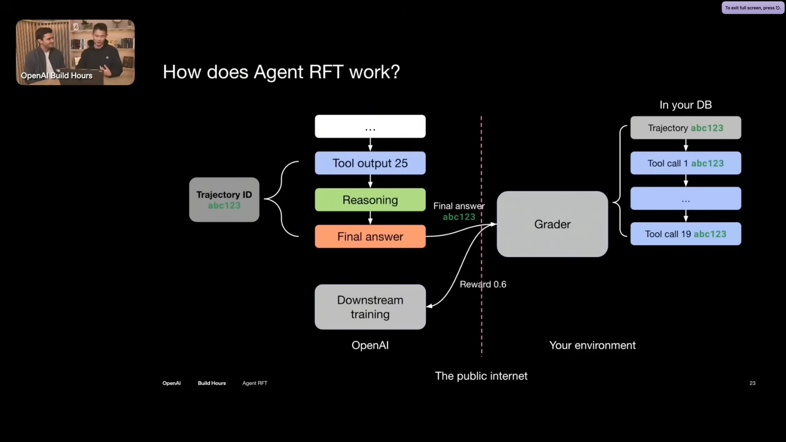

# Automating Business Workflows with Trainable Agents

The goal: automate a business workflow so an agent performs it autonomously, at human-level quality or better.

---

## What Is an Agent?

An agent is a system, not a model:

```
Agent = LLM + Prompts + Tools + Orchestration
```

The LLM provides reasoning. Prompts encode domain knowledge and instructions. Tools give the agent capabilities (file access, code execution, search). Orchestration ties it together (loops, error handling, state management).

When you improve an agent, you can change any of these components. Most of my current leverage is in prompts and tools. The LLM itself is either frozen (API) or trainable (owned weights).

---

## Frozen Core vs. Trainable Core

If I use Claude via API, the model is frozen. I can:
- Improve prompts (instructions, examples, structure)
- Add/refine tools (capabilities, error messages)
- Improve orchestration (retries, validation, checkpoints)

I cannot update the model's weights. Knowledge stays in the prompts. Behavior changes come from better instructions, not better understanding.

If I own a model (Llama, Mistral, Qwen, etc.), I can update its weights. Knowledge can move from prompts into the model. Behavior changes come from the model itself getting better at the task.

This is the trainable core distinction. An API agent has a frozen core. An owned agent has a trainable core.

---

## The Ceiling of Prompt Optimization

Prompt optimization is powerful. Better prompts can:
- Add domain knowledge the model lacks
- Structure complex tasks into manageable steps
- Provide examples that guide behavior
- Handle edge cases and error recovery

But prompt optimization has limits:
- Context window bounds how much knowledge fits
- Instructions are interpreted, not internalized
- The model's base capabilities don't improve
- Each session starts from scratch (no persistent learning)

Prompt optimization improves instructions to a fixed reasoner. It doesn't make the reasoner better.

For some workflows, this ceiling is high enough. For others, it's not.

---

## The Path

The progression from assisted workflow to autonomous agent:

**Stage 1: Human + API Agent**

Today's state. Claude Code (or similar) with my prompts and tools. Human in the loop for course correction, quality gates, ambiguity resolution, and recovery. The agent does work; the human ensures quality.

**Stage 2: Prompt-Optimized API Agent**

Same architecture, better prompts. I run the workflow repeatedly, observe failures, and improve prompts. I collect traces of successful executions. Over time, the agent handles more cases autonomously. The human intervenes less often.

This is the ceiling of API-based agents. Still requires human oversight because the core hasn't learned—only the instructions improved.

**Stage 3: SFT on Owned Model**

I take the successful traces from Stage 2 and use them to train an owned model. The model learns to produce similar outputs given similar inputs. Knowledge moves from prompts into weights.

The model doesn't need the detailed prompts anymore—behavior is baked in. Runs faster (less context). Works offline. I control the deployment.

**Stage 4: RL on Owned Model (Optional)**

I run the SFT model in the environment and provide reward signals. The model explores beyond the demonstrations. It may discover strategies I didn't demonstrate.

Whether this stage adds value depends on whether I have a reward signal that can guide the model beyond what I showed it.

---

## On SFT vs. RL

A common framing: SFT imitates humans, RL exceeds them.

This is an oversimplification. The real distinction:

| Aspect | SFT | RL |
|--------|-----|-----|
| Learning signal | Demonstrations (static dataset) | Rewards (interactive feedback) |
| What's optimized | Similarity to training outputs | Expected cumulative reward |
| Exploration | None (only sees what's in data) | Active (entropy bonus, sampling) |
| Can find novel strategies? | Limited (generalization only) | Yes (reward guides search) |

SFT learns "when I see X, produce Y" from examples. RL learns "maximize this signal" through trial and error.

But whether RL exceeds human performance depends on the reward signal:
- If reward = "human approves this" → bounded by human judgment
- If reward = "tests pass" → can exceed human if model finds valid solutions humans didn't
- If reward = composite (tests + style + efficiency) → can optimize trade-offs humans wouldn't

The question isn't "SFT or RL?" It's "what signal can I give, and what does optimizing it buy me?"

---

## The Evaluation Problem

My workflows have no clear automated success signal. Quality requires human judgment.

This creates a tension:
- Prompt optimization needs a score to compare variants
- SFT needs labeled examples (which I provide by doing the work)
- RL needs a reward signal for every rollout

Options:

**Human-in-the-loop evaluation.** I review outputs and provide scores. Accurate but doesn't scale. Works for prompt optimization and SFT data collection. For RL, means RLHF (reinforcement learning from human feedback).

**LLM-as-judge.** Another model evaluates outputs against criteria. Scales better. But the judge's biases become my agent's biases. And if the judge can't evaluate correctly, neither can the trained agent.

**Proxy metrics.** Tests pass, linter clean, type-checks, code compiles. Not complete but verifiable. Works as a floor (necessary but not sufficient for quality).

**Decomposition.** Break "good workflow execution" into evaluable sub-tasks. Some have clear signals (code compiles), others need judgment (solution is elegant). Evaluate what I can, sample-review the rest.

I don't have this solved. It's an open problem in my setup. The approach will likely be: proxy metrics as baseline, LLM-judge for style/quality, human review on a sample for calibration.

---

## Model Selection

For the trainable core, I need to choose a base model. Considerations:

| Factor | What to look for |
|--------|------------------|
| Reasoning capability | Strong base reasoning (Claude-level not necessary, but not weak) |
| Tool use training | Models trained on tool-calling data adapt faster |
| Size vs. latency | Larger = more capable, but slower inference |
| Fine-tuning support | Good documentation, active community, known issues |
| Licensing | Can I deploy it commercially? |

Current landscape (2025): Llama 3.x, Mistral, Qwen 2.5 are solid options. The "best" depends on my specific tasks and constraints. Empirical testing matters more than benchmarks.

I don't need to decide now. Trace collection is model-agnostic. The same traces can train any model later.

---

## The Training Loop

The pattern for training agents on workflows (illustrated by OpenAI's "Agent RFT"):



```
┌─────────────────────────────────────────────────────────────────────┐
│  Your Environment                                                    │
│                                                                      │
│  Task → Agent executes → Trajectory (tool calls, reasoning, answer) │
│                                   │                                  │
│                                   ▼                                  │
│                              Store in DB                             │
│                          (trajectory + tool calls)                   │
└─────────────────────────────────────────────────────────────────────┘
                                    │
                                    │ Final answer
                                    ▼
┌─────────────────────────────────────────────────────────────────────┐
│  Grader                                                              │
│                                                                      │
│  Evaluates trajectory → Produces reward (e.g., 0.6)                 │
└─────────────────────────────────────────────────────────────────────┘
                                    │
                                    │ Reward signal
                                    ▼
┌─────────────────────────────────────────────────────────────────────┐
│  Training                                                            │
│                                                                      │
│  SFT: Use high-reward trajectories as demonstrations                │
│  RL:  Use reward signal to update policy                            │
└─────────────────────────────────────────────────────────────────────┘
```

The key insight: I'm already generating trajectories when I use Claude Code. The question is whether I'm capturing them.

---

## Getting Started: Trace Collection

The first actionable step is trace collection.

Every time I run my workflow with Claude Code (or any agent), I can capture:
- The task/input
- Each tool call and its result
- The final output
- Whether it succeeded (by my judgment)

These traces serve multiple purposes:
- **Prompt optimization**: Analyze failures, identify patterns, improve prompts
- **SFT**: Successful traces become training examples
- **RLHF**: Human judgments on traces become reward signal

### Implementation Approach

Build a custom executor using the Anthropic SDK. Claude Code's tools are straightforward to replicate:
- `read_file` → `Path.read_text()`
- `write_file` → `Path.write_text()`
- `bash` → `subprocess.run()`
- `search` → `ripgrep` subprocess
- `glob` → `pathlib.glob()`

The executor runs the agent loop and logs every step:

```python
@dataclass
class ToolCall:
    tool: str
    args: dict
    result: str
    timestamp: str

@dataclass
class Trace:
    id: str
    task: str
    system_prompt: str
    steps: list[ToolCall]
    final_response: str
    score: float | None  # Added after evaluation

def run_with_trace(task: str, system_prompt: str) -> Trace:
    """Execute task and capture full trace."""
    client = anthropic.Anthropic()
    messages = [{"role": "user", "content": task}]
    steps = []

    while True:
        response = client.messages.create(
            model="claude-sonnet-4-20250514",
            max_tokens=4096,
            system=system_prompt,
            tools=TOOLS,
            messages=messages,
        )

        if response.stop_reason == "end_turn":
            return Trace(
                id=str(uuid.uuid4()),
                task=task,
                system_prompt=system_prompt,
                steps=steps,
                final_response=extract_text(response),
                score=None,
            )

        # Execute tool calls, record results
        for block in response.content:
            if block.type == "tool_use":
                result = execute_tool(block.name, block.input)
                steps.append(ToolCall(
                    tool=block.name,
                    args=block.input,
                    result=result[:2000],  # Truncate for storage
                    timestamp=datetime.now().isoformat(),
                ))

        # Continue conversation with tool results
        messages.append({"role": "assistant", "content": response.content})
        messages.append({"role": "user", "content": tool_results})
```

### Trace Format

```json
{
  "id": "a1b2c3d4-...",
  "task": "Fix the bug in auth.py where login fails for emails with + symbols",
  "system_prompt": "You are an expert...",
  "steps": [
    {
      "tool": "read_file",
      "args": {"path": "auth.py"},
      "result": "def login(email, password):...",
      "timestamp": "2025-01-06T10:30:00"
    },
    {
      "tool": "write_file",
      "args": {"path": "auth.py", "content": "..."},
      "result": "ok",
      "timestamp": "2025-01-06T10:30:05"
    },
    {
      "tool": "bash",
      "args": {"command": "pytest test_auth.py"},
      "result": "...... OK",
      "timestamp": "2025-01-06T10:30:10"
    }
  ],
  "final_response": "Fixed the bug by...",
  "score": 0.9
}
```

I don't need fine-tuning infrastructure yet. I need traces. Start collecting now; decide how to use them later.

---

## Converting Traces to Training Data

### For SFT

Filter to successful traces, convert to chat format:

```python
def trace_to_sft(trace: Trace, min_score: float = 0.8) -> dict | None:
    if trace.score < min_score:
        return None

    messages = [{"role": "user", "content": trace.task}]

    for step in trace.steps:
        messages.append({
            "role": "assistant",
            "tool_calls": [{"function": {"name": step.tool, "arguments": json.dumps(step.args)}}]
        })
        messages.append({
            "role": "tool",
            "content": step.result
        })

    messages.append({
        "role": "assistant",
        "content": trace.final_response
    })

    return {"messages": messages}
```

### Loss Masking

SFT trains on assistant outputs only. User messages and tool results are context, not targets.

```
Token positions:
[USER] Fix the bug [ASSISTANT] Let me read [TOOL] content... [ASSISTANT] Fixed it

Loss mask:
  0        0          1          1       0       0          1        1
  ↑ context (ignored)           ↑ train on this             ↑ train on this
```

Most frameworks handle this automatically (TRL, Axolotl). The key is understanding that the model learns to produce assistant tokens given context, not to predict the context itself.

---

## What "Done" Looks Like

The end state depends on what I decide I want:

**Autonomous with spot-checks.** Agent runs workflows without intervention. I review a sample of outputs for quality assurance. Intervention rate is low enough that it's not the bottleneck.

**Autonomous with guardrails.** Agent runs independently but escalates when uncertain. Quality is maintained because the agent knows what it doesn't know.

**Continuously improving.** Agent runs, I provide occasional feedback, model gets updated periodically. Performance trends upward over time.

I haven't decided which of these is my target. The choice affects how much RL infrastructure I need and whether human feedback stays in the loop permanently or phases out.

---

## Open Questions

What I haven't figured out yet:

1. **Evaluation design.** How do I approximate quality automatically? What's the right mix of proxy metrics, LLM-judge, and human review?

2. **The end state.** Do I want the human out of the loop entirely? Or is "agent + human verifier" good enough?

3. **When RL is worth it.** SFT on good traces might be enough. RL is more complex and needs reward engineering. When does the added complexity pay off?

4. **Model selection timing.** Do I pick a model now and start building around it? Or stay model-agnostic until I have enough traces to run experiments?

5. **The taste/judgment gap.** Some of my domain knowledge is tacit—I know good output when I see it, but can't articulate why. How do I transfer this to a model?

These are research questions for me. This document is the framing that helps me think about them.
