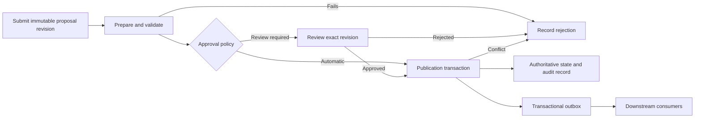
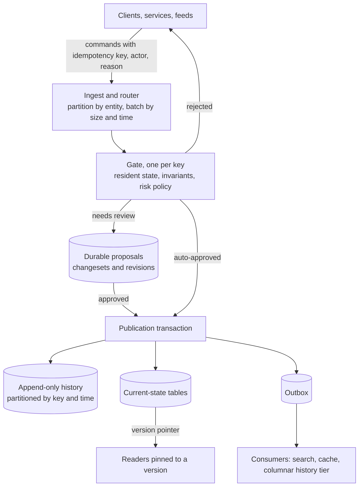

# The Log Is the Database

High-throughput writes with provenance and controlled publication.

## 1. The one idea

Every serious database, underneath its tables and indexes, is an append-only log of changes. The tables are a cache of what the log implies. The engines are built this way because a sequential append is the cheapest durable operation a machine can perform, and everything else can be derived from it later.

If you design your own system the same way, three things that usually fight each other stop fighting. Provenance becomes a property of the log rather than something bolted on afterwards. Controlling who may publish a change becomes a validator standing in front of the log rather than a queue everything waits in. And performance reduces to keeping one path fast: the append.

The publication workflow establishes which changes may become authoritative. The database's transactions and concurrency control establish whether those changes can be applied correctly together. You need both, and this document treats them as two halves of one design.

### A running example

Consider a product catalogue updated by supplier feeds, automated pricing jobs, and administrators. Routine supplier updates pass automated checks and publish within milliseconds. A large price correction requires a person to inspect and approve it. Every published change should explain who initiated it, why, which inputs supported it, and which version of the rules allowed it. The catalogue will reappear throughout.

### Define the workload first

Before choosing technology, answer a few questions. How many writes arrive per second, how large are they, and how many touch the same product? How quickly must a submitted change become visible? What failures must an acknowledged publication survive? Which operations require human approval? Must a bulk update become visible all at once?

These answers describe different dimensions of performance. A system can accept proposals quickly while taking hours to publish them. It can sustain high total throughput while struggling with one frequently updated record. Measure proposal acceptance, publication, and downstream visibility as three separate latencies, because they will have three separate causes.

## 2. How databases absorb writes

Every mainstream engine handles thousands of concurrent writes a second with the same handful of mechanisms.

**Write-ahead log.** Each transaction is appended to a sequential file and fsynced before the client hears back. Tables and indexes are updated later, from memory. The log is the only thing that has to reach disk for the write to be durable. Postgres calls it the WAL, MySQL the redo log, Cassandra the commit log.

**Group commit.** Under load the engine collects many concurrent transactions and fsyncs them together, so one disk flush covers fifty commits. This is why throughput rises with concurrency on a well-built engine instead of collapsing under it.

**Buffer pool and checkpoints.** Modified pages live in memory as dirty pages and are flushed in the background. A checkpoint is the moment when enough has been flushed that the log before it can be discarded.

**B-trees and LSM trees.** A B-tree updates in place, which is good for reads and range scans but pays a random write per update. A log-structured merge tree never updates in place: writes go to an in-memory buffer, get flushed as sorted immutable files, and background compaction merges those files. RocksDB, Cassandra, ScyllaDB and ClickHouse use LSMs because they turn random writes into sequential ones. The cost lands on reads, which may consult several files, and on disk space during compaction.

**Multi-version concurrency control.** A write creates a new row version stamped with its transaction ID instead of overwriting. Readers see the snapshot that was current when they started, so writers and readers rarely block each other. Old versions are garbage collected once no transaction can see them. MVCC gives consistent views, not audit history: the old versions are reclaimed, not retained.

**Partitioning.** When a single node's log becomes the bottleneck, the key space is split so unrelated entities land on separate logs. Ordering is only guaranteed within a partition. That is usually enough, because most invariants are per-entity.

### What the engine does not do for you

A transaction groups operations into a commit or rollback, and its isolation level determines how concurrent transactions may interact. Serializable isolation makes committed transactions equivalent to some sequential execution, but the application must handle transaction failures and retries. Wrapping operations in a transaction does not prevent every anomaly at every isolation level; write skew under snapshot isolation is the classic surprise.

The application still owns business invariants, authorization, provenance, and what to do when a proposal is stale. The simplest protection is an expected version:

```sql
UPDATE products
SET price = :new_price,
    version = version + 1
WHERE id = :product_id
  AND version = :expected_version;
```

If no row is updated, the expected version is gone: the row changed or was deleted. The publisher must resolve that before claiming success. This check protects the target row. Rules that depend on other rows need more, which is the subject of section 5.

## 3. Recording intent and provenance

Three words get used interchangeably and mean different things. An audit trail describes actions and changes: who did what, when. Provenance describes origins, production, and responsibility: where a value came from and what justified it. Lineage traces the relationships between inputs, transformations, and outputs across systems. W3C PROV formalizes provenance through entities, activities, and agents. A database recovery log or a stream of row changes gives you the audit trail almost for free. It does not give you the business explanation, because the engine cannot know why.

### The changeset as a first-class object

The unit that validation, approval, publication, and history refer to is the changeset: a coherent operation or group of operations with a stable identity. For the catalogue, a changeset might carry:

| Information | Example |
|---|---|
| Identity and revision | Changeset `C123`, revision `4` |
| Intended operation | Set product `P42` price to `80` |
| Expected state | Product version `12` |
| Actor and delegation | Pricing service acting for administrator `U17` |
| Reason | Correction requested in ticket `T92` |
| Inputs | Supplier document revision `S8`, cost record version `6` |
| Processing rules | Pricing rule version `7` |
| Validation | Checks run, results, and the exact inputs checked |
| Approval | Approver or automated policy, proposal revision, decision time |
| Publication | Outcome, committed version, publication time |
| Retry identity | Idempotency key for the logical operation |

A few rules make this useful rather than decorative. Derive actor identity from authenticated context, never from the payload. Store input references that resolve to retained versions, so a later change to the supplier document does not erase the basis of the decision. Share common metadata at changeset level, with per-record references or exceptions where needed. A supplier import of a thousand rows has one reason and one approval, while each row keeps its own lineage.

### What each record carries

Within a changeset, each recorded change should carry:

- **Actor.** The user, service or job that caused it, plus who it was acting for.
- **Reason.** Free text or a coded intent. Treat its absence as a bug, the way a missing commit message would be.
- **Correlation ID.** Shared by everything that happened in response to one external request.
- **Causation ID.** The specific command or event that directly caused this one.
- **Entity and version.** Which stream this belongs to and its position in it.
- **Recorded time.** When the system wrote it.

### Never update in place

Corrections are new records that supersede old ones. Deletions are tombstones. If late arrivals and retrospective corrections matter, distinguish when a fact applies from when the system recorded it. A supplier price might take effect on Monday but arrive on Wednesday. Bitemporal data tracks both: valid time, when the fact held in the world, and system time, when the database learned it. It is the only way to answer "what did we believe on March 3rd, and were we right."

### Detect conflicts rather than overwrite

Every write carries the entity version it was based on. If the stored version has moved, the write is rejected and the caller reloads. Under many writers this optimistic approach scales far better than locks, provided conflicts are rare. Small, well-chosen entity boundaries keep them rare.

### Change data capture over audit triggers

Trigger-based audit tables run inside the transaction and slow the hot path. Reading the engine's own WAL, through Postgres logical replication or a tool such as Debezium, captures every row change at no cost to writers. CDC sees the diff, not the reason, which is one more argument for keeping the reason in the data rather than in a side channel.

### A concrete starting point

Two append-only tables in Postgres cover a surprising amount:

```sql
create table changesets (
  id             uuid primary key,
  revision       int  not null,
  actor          text not null,
  on_behalf_of   text,
  reason         text not null,
  correlation_id uuid not null,
  inputs         jsonb not null,     -- references to retained versions
  rule_version   int,
  status         text not null,      -- proposed, validated, approved, published, rejected
  idempotency_key text not null unique,
  created_at     timestamptz not null default now()
);

create table events (
  seq            bigserial primary key,
  changeset_id   uuid not null references changesets(id),
  entity_id      uuid not null,
  version        int  not null,
  event_type     text not null,
  payload        jsonb not null,
  causation_id   uuid,
  valid_from     timestamptz,
  recorded_at    timestamptz not null default now(),
  unique (entity_id, version)
);
```

The unique constraint on the events table is the optimistic concurrency check. The idempotency key on changesets makes retries safe. Current-state tables such as `products` are projections, updated in the publication transaction or by a consumer downstream.

## 4. Controlled publication

Should anything write directly, or should every change pass through a proposal-and-publish workflow, like a pull request for data? The precise constraint is that authoritative, production-visible state changes only through an authorized publication path. Drafts and proposals can be stored durably before publication; they simply are not visible as truth.

"Pull request" bundles three separate ideas, and only one belongs everywhere:

- **Indirection.** Nobody writes to the store directly. A change is submitted as a proposal that a gatekeeper validates before it becomes a fact.
- **Isolation.** The proposal lives where it cannot affect readers until accepted: a branch, a staging table, a draft row.
- **Human review.** A person approves before it lands.

Indirection is universal good practice. Isolation is well proven in specific forms. Human review only works where the change rate is human-scale, or can be batched into human-scale changesets.

### The established patterns

| Pattern | Mechanism | Fits | Implementations |
|---|---|---|---|
| Command handling | Submit a meaningful operation; authorize, validate, and commit it in one request | Operational data: orders, user actions, routine supplier updates | Any application service layer; the aggregate in event sourcing |
| Maker-checker | One party proposes, a different party approves before it takes effect | High-stakes single operations: payments, permission grants, large price corrections | A pending-status row and a workflow; Oracle documents it for transaction authorization |
| Write-audit-publish | Stage an isolated version, run checks, promote atomically | Imports, analytics tables, dataset releases | Iceberg branches, lakeFS, Project Nessie, a staging table with a swap |
| Data version control | Branch, edit, diff, resolve conflicts, merge | Collaborative editing of curated data, alternative dataset versions | Dolt, TerminusDB, lakeFS |
| Draft and publish | A row with a status, review as a state transition | Content, configuration, small reference tables | Every content management system |

In the catalogue, a supplier feed goes through command handling and publishes automatically. A large price correction goes through maker-checker. A quarterly re-import of the whole catalogue goes through write-audit-publish.

### Where the idea breaks

Human gates on machine-speed writes cannot keep up. If feeds write thousands of times a second, either batch into changesets on a human cadence or drop the human and keep the automated gate.

Stale bases are worse for data than for code. A change proposed against yesterday's data may be wrong by the time it is approved, and two individually valid rows can violate an invariant together. Dolt detects cell-level conflicts, but constraint violations after a merge are still yours to resolve.

Long-lived branches of operational data confuse everything that reads the store while the branch is open. Keep branches short and narrow.

The one design to avoid is a single review workflow that every write in the system must pass through. It collapses five different problems into one queue, and the queue becomes the system.

### The publication workflow



Approval and publication are distinct steps. An approved proposal may still hit a conflict or fail to publish, and the record should show which happened.

One workflow does not require a network hop for every stage. Routine automated changes execute every step within a single request. When a change must wait for review or lengthy processing, persist its progress so a worker can resume after a failure. The same checks apply either way.

### The publication transaction

For a relational implementation, the final transaction should:

1. Verify the proposal revision and its approval are current.
2. Check the expected versions of the rows it touches, and any dependencies the decision rested on.
3. Apply the changes to current-state tables.
4. Append the publication record to the history.
5. Mark the proposal published.
6. Write an outbox row if other systems need to hear about it.

A worker delivers outbox messages after commit, and consumers must tolerate duplicates. Persist review and rejection history outside this transaction. Otherwise a failed publication rolls back the record explaining why it failed. Successful state changes and their publication records commit together.

### Enforce the boundary with permissions

Ordinary producers hold permission to insert proposals or submit commands, and nothing else. The publication service, or a designated set of stored procedures, is the only principal that can mutate authoritative tables. Readers use published state, with an explicit interface for inspecting drafts. Without this, the workflow is a convention, and conventions erode.

## 5. Keeping approval meaningful

Approval must remain meaningful while other writers keep working. The mechanism is to attach approvals and validation results to an exact, immutable proposal revision. Editing a proposal creates a new revision whose approval requirements are evaluated again.

### The stale-basis problem

Suppose a reviewer approves a price of `80` for product `P42` based on a supplier cost of `60`. Before publication, the cost changes to `90`. The product row's version is unchanged, so the expected-version check passes, but the basis for the approval is gone. Checking only the row being updated misses it.

Track the data dependencies relevant to the decision and protect their validity at publication. Depending on the rule, that may mean recording the versions of the rows that were read and checking them, taking a lock, or running the publication under serializable isolation. Checks involving the absence of rows or totals over a set need particular care, because a list of previously read row versions cannot capture a row that did not exist yet.

### Structural merge is not business correctness

A clean merge in a versioned database shows that two changesets touched different cells. It says nothing about whether a shared budget, capacity, or uniqueness rule still holds. Database concurrency control has to cover the business invariant, and the invariant has to be written down somewhere the publication transaction can check it.

### What does the reviewer approve?

Decide whether a reviewer approves an exact resulting change or an operation whose permitted behavior is explicitly defined. If a recomputation after rebase changes the approved meaning or effect, obtain approval for the new revision. Treat automatic retries as a correctness decision rather than blindly re-applying a stale patch.

### Idempotent publication

A timeout may occur after a successful commit but before the client sees the response. A stable operation key, enforced transactionally, lets the retry retrieve the original outcome instead of applying the change twice. This belongs in the publication transaction, not in a cache in front of it.

### The limit

When an invariant spans many keys, no per-key trick saves you and the gate has to coordinate. That is the one place a real cost returns. The options are to narrow the invariant so it fits inside one entity, to enforce it eventually through a reconciliation consumer that raises exceptions after the fact, or to route those specific writes through a slower serialized path. Design so that path carries a small fraction of the traffic.

## 6. Staying fast

The write side now has three moving parts: the gate, the append, and the publish. Performance comes down to keeping the gate a memory operation, the append a single sequential write, and the publish a pointer flip. Preparation, validation, and review can run concurrently across immutable proposals; the final transaction should hold shared resources only while doing the checks and mutations that need current state.

| Design choice | Benefit | Boundary or cost |
|---|---|---|
| Parallel preparation | Scales parsing, transformation, and validation across workers | Validators still need capacity |
| Independent publication | Unrelated changes commit concurrently | Shared invariants still coordinate |
| Short transactions | Reduces lock duration | Current-state checks must stay protected |
| Reusable validation results | Avoids repeating expensive checks | Valid only while inputs, rules, and approvals are unchanged |
| Bounded batching | Amortizes workflow and commit overhead | Larger batches mean longer waits and wider retries |
| Compact changesets | Less repeated metadata | Keep enough to explain and reconstruct |
| Selective indexes | Less index maintenance per write | Keep what queries and integrity need |
| Asynchronous downstream work | Removes optional work from publication latency | Consumers lag and must tolerate retries |

### Protect the append

An accepted change touches one log on one partition. No synchronous projection updates, no triggers doing lookups, no fan-out to other stores before the acknowledgement.

Batch at every layer. Clients batch per request, the ingest layer batches per partition, the database group-commits. Bound batches by both size and time so latency stays predictable when load is light.

Indexes belong on projections, not on the log. The event table gets one clustered key and nothing else. Every secondary index is a random write per event.

Keep rows narrow. Actor as an ID, not a name. Reason as an enum or an interned reference, with free text in a side table. Payload in a binary schema such as Protobuf or Avro rather than loose JSON. Row width drives write amplification directly.

Put the log on local NVMe. The fsync latency of the log device sets the floor under commit latency, and network-attached disks add milliseconds that group commit only partly hides.

### Make the gate cheap

The gate for a key needs that key's current state and the invariants. Keep the state resident and snapshot-backed, and the decision becomes a pure function with no I/O.

Route all proposals for a key to a single worker. It never needs locks or optimistic retries, because nothing else touches that key. Shard the validators the same way the log is sharded. Adding workers beyond useful concurrency increases contention and retry work rather than throughput.

Cost should scale with the change, not the dataset. Check the rows in the proposal and their direct dependencies. If an invariant needs aggregate knowledge, maintain the aggregate incrementally so the check is a lookup.

Decide when to validate. If the client only needs to know the proposal was durably received, append it to an inbox, acknowledge, and validate behind it. If the client needs to know it was accepted, validate in memory first and then append. Either way it is one sequential write. Which one depends on who has to hear about rejection.

Tier by risk. Policy decides at submission time whether a proposal is auto-approved, machine-checked, or queued for a person. Most writes should land in the first bucket.

### Make publish O(1)

Staged data is already written where it will live. Publishing means updating a pointer, committing a manifest, or attaching a partition. Iceberg commits through metadata replacement, lakeFS merges, and Postgres table swaps all work this way, and the cost does not depend on how much data the changeset holds. The payload work still exists; it just happens before publication, in parallel.

Readers pin a version. A reader starts on a published snapshot and stays there until it chooses to move. Publishing never invalidates in-flight reads.

An atomic reference change has a defined scope. Atomic publication of one table does not give you atomic publication across several tables or external systems, and a short metadata update does not remove contention on one busy table head. Choose a store whose transaction or snapshot boundary matches the unit readers must see consistently.

Pending proposals live in their own partitions or tables, with their own indexes, so they add nothing to the published data path. Old versions are garbage collected on a schedule, never on the publish path.

### Reads never touch history

Snapshot aggressively. Replay from zero is for rebuilds, never for serving a request. Snapshot every few hundred events and keep the state an entity needs for its decisions small.

Projections are denormalized and fully indexed, one per query shape. Cache each entity's current version so the concurrency check hits memory.

Tier storage. Recent events on fast disk, older ones compacted into columnar files in object storage. History searches, lineage visualizations and dashboards are built there, asynchronously, so they never load the write path.

### Consumers are the pressure valve

Consumer lag is the number to watch. Consumers batch, run per partition, and are idempotent. Commit the offset in the same transaction as the projection write so a crash replays without double-applying.

Queues absorb bursts and backpressure prevents unbounded accumulation, but neither adds capacity to the slowest sustained stage. Measure backlog age as well as size. If every proposal needs a human, publication latency includes human response time and throughput is capped by review capacity. Automated approval lifts that cap only where policy allows it.

For read-your-writes, return the new version to the client and let a read wait for the projection to reach it, only where that guarantee is actually needed.

### Growth and background work

Partition by time so retention is a drop, not a delete. Compact state-like streams so only the latest record per key stays hot. Append-only tables barely need vacuum; projections churn, so tune fill factor there and expect bloat.

Background work is part of sustained capacity. Postgres must reclaim obsolete row versions and LSM engines must keep compacting. Load tests should include that work, a realistic history size, concurrent reads, and uneven traffic. Rehearse the full rebuild and keep its duration under a limit you can live with. A rebuild that has never been run is the part that fails.

## 7. A reference architecture

For an operational application, the practical starting point is: a transactional database, a controlled command API, current-state tables, an append-only history, durable proposals wherever waiting or review is required, and a transactional outbox for downstream publication. This gives a concrete enforcement point and explicit provenance without database branching or full event sourcing.



### When to go further

Choose write-audit-publish with snapshot publication when the unit of work is a dataset release. Choose database branching when users need isolated alternative versions, detailed diffs, and merges. Choose event sourcing when the event history itself should be authoritative and replay is central to the product. Event sourcing brings event evolution and projection concerns, and it still needs approval policy and concurrency control. CQRS separates write and read models and can be used with or without it.

### Scaling path

Start with Postgres alone. The tables from section 3, projections in the same database, logical replication for downstream consumers. With batching this reaches tens of thousands of events per second on ordinary hardware.

When Postgres cannot keep up with ingest, put a durable log such as Kafka or Redpanda in front, keyed by entity so per-entity ordering survives. Consumers materialize projections into whatever store fits each query shape.

When history outgrows fast disk, compact older partitions into Parquet on object storage and query them with a columnar engine. ClickHouse or DuckDB over Iceberg tables is a common combination. The write path never sees this tier.

## 8. Objectives, metrics, and tests

Validate the design against explicit objectives: committed writes per second, p95 and p99 publication latency, acceptable downstream lag, and durability under specified failures.

| Metric | What it tells you |
|---|---|
| Bytes per change | Whether rows are staying narrow |
| p99 append latency | Whether something crept back onto the hot path |
| fsync latency on the log device | The floor under commit latency |
| Proposal-to-publish latency, by tier | Whether the gate or the review queue is the bottleneck |
| Approval delay and backlog age | Whether human review is the limiting stage |
| Lock waits, conflict rate, retries | Whether coordination is growing with load |
| Consumer lag | Whether projections are falling behind |
| Full rebuild time | Whether you can still recover from a broken projection |

Test the cases that decide whether the workflow stays correct under load:

- Duplicate submission of the same proposal.
- A timeout after commit but before the response.
- An approval whose basis changed before publication.
- Two changesets that conflict at publication.
- A worker that dies mid-workflow and must resume.

## 9. Costs and non-goals

**Storage grows forever.** Plan snapshots, tiering, and retention before the log becomes the biggest thing you own. Make sure obsolete staging data can be reclaimed without deleting evidence that a published change references.

**Deletion is awkward.** Immutable logs conflict with requirements such as GDPR erasure. The usual answer is crypto-shredding: encrypt each subject's data under its own key and delete the key. Decide this early; retrofitting per-subject encryption onto an existing log is painful.

**Schemas evolve.** Old records stay in their old shape. Upcasting translates them on read, which means every consumer needs the translation code, forever. Keep schemas small and additive.

**Not everything should be event-sourced.** For most systems, current-state tables plus an append-only history with actor and reason, plus CDC, give most of the benefit at a fraction of the complexity. Full event sourcing earns its cost where invariants are subtle, audit is a legal requirement, or the history itself is the product. It probably does not earn it for a settings table.

**Eventual consistency is real.** Projections lag the log. Any part of the product that cannot tolerate that needs the version-wait trick from section 6 or a projection updated in the publication transaction, and both cost something.

**A workflow is not a substitute for concurrency control.** The workflow decides what may become authoritative. The database decides whether it can be applied correctly alongside everything else. Skipping either one produces a system that is auditable but wrong, or correct but unexplainable.

## Appendix A: glossary

### Storage and the write path

- **Write-ahead log (WAL).** The append-only file every change goes to before anything else. Also called redo log, commit log, or journal.
- **Durability.** An acknowledged write survives a crash. Achieved by fsyncing the log before replying.
- **Group commit.** Batching many concurrent transactions into one fsync.
- **Buffer pool.** The in-memory cache of data pages. Modified pages are dirty until flushed.
- **Checkpoint.** The point at which dirty pages are flushed so the WAL before it can be discarded.
- **B-tree.** The classic update-in-place index. Good for reads and range scans, pays random writes on every update.
- **Log-structured merge tree (LSM).** A write-optimized structure that buffers writes in memory and flushes sorted immutable files, merged later by compaction.
- **Memtable and SSTable.** The in-memory buffer and the sorted on-disk file an LSM produces from it.
- **Compaction and vacuuming.** Engine maintenance that merges files or reclaims obsolete row versions. Part of sustained capacity, not an afterthought.
- **Write, read and space amplification.** The ratio of physical to logical work. B-trees have high write amplification, LSMs high read and space amplification.
- **Append-only.** A structure that only grows at the end. Cheap to write, easy to replicate, naturally a history. Permissions and storage controls decide whether it is enforced.
- **Copy-on-write.** Modifying by writing a new copy and swapping a pointer, leaving the old version intact.
- **Partitioning and sharding.** Partitioning divides data into slices with their own ordering; sharding distributes those slices across nodes.
- **Replication.** Copying the log to other nodes. Synchronous waits for followers before acknowledging; asynchronous does not.
- **Quorum.** The minimum number of replicas that must agree for a write or read to count.
- **Working set.** The data and indexes a workload actively touches. Performance changes sharply when it stops fitting in memory.
- **Idempotency key.** A client-supplied unique ID so a retried write is recognized and not applied twice.
- **Backpressure.** Slowing producers when consumers or storage cannot keep up, instead of dropping or buffering without bound.

### Concurrency and transactions

- **Transaction.** A group of operations that commit or roll back together.
- **ACID.** Atomicity, consistency, isolation, durability. Consistency here means defined invariants hold; isolation governs how concurrent transactions interact.
- **Invariant.** A rule that must remain true across every valid state change.
- **Isolation level.** How much a transaction may see of concurrent transactions. Weakest to strongest: read uncommitted, read committed, repeatable read, snapshot isolation, serializable.
- **Multi-version concurrency control (MVCC).** Keeping multiple versions of each row, each tagged with the writing transaction, so readers see a consistent snapshot without blocking writers. Versions are reclaimed, so this is not audit history.
- **Snapshot.** The frozen view a transaction reads from under MVCC.
- **Transaction ID.** The monotonically increasing number that stamps versions and decides visibility.
- **Lock.** A transaction-scoped hold on a row or table. A latch is the same idea at microsecond scale for in-memory structures.
- **Deadlock.** A cycle of transactions each waiting for a lock another holds. The engine detects it and kills one.
- **Two-phase locking.** Acquire all locks, then release all locks, never interleave. The classic route to serializability.
- **Pessimistic concurrency.** Lock first, then write. Safe but serializes writers.
- **Optimistic concurrency control.** Read a version, write conditionally on it being unchanged, retry on conflict. The right default when conflicts are rare.
- **Compare-and-swap.** The atomic primitive behind optimistic writes: update only if the current value matches what I expect.
- **Lost update, write skew, phantom read.** The named anomalies weaker isolation levels permit. Write skew is the one that surprises people under snapshot isolation.
- **Serializability.** The outcome equals some serial execution of the transactions. Linearizability is the single-object, real-time version of the same idea.
- **Consensus.** A protocol such as Raft or Paxos by which replicas agree on log order despite failures. Usually elects a leader that all writes go through.
- **Logical clock.** An ordering device that does not trust wall time. Lamport clocks give a total order consistent with causality, vector clocks detect concurrency, hybrid logical clocks combine wall time with a counter.
- **Total order versus partial order.** Whether every pair of events is comparable. Within a partition you get total order, across partitions only partial.
- **Contention and hot key.** Competition for a shared resource. A hot key receives a disproportionate share of writes and remains a serial bottleneck however many partitions exist.
- **Eventual consistency.** Replicas or derived views may lag but converge once updates stop and propagation succeeds.

### Provenance, history and streaming

- **Audit trail.** A history of actions and changes with captured identity and context. Records what, not why.
- **Provenance.** Information about a datum's origins, production, and responsibility.
- **Data lineage.** The relationships tracing data through sources and transformations.
- **Entity, activity, agent.** The W3C PROV concepts for artifacts, processes, and responsible parties.
- **System of record.** The authoritative source for a category of data.
- **Changeset.** A coherent, identified group of proposed or committed changes. The unit that validation, approval, and publication refer to.
- **Command.** A request to perform an operation. It may be rejected.
- **Domain event.** An immutable record that something meaningful happened, named in past tense.
- **Event sourcing.** Storing the sequence of events as the system of record and deriving current state by folding over them.
- **Stream and aggregate.** The ordered events for one entity, and the consistency boundary those events protect. Versions are per stream.
- **Event store.** A database specialized for appending to and reading streams, with expected-version checks.
- **Expected version.** The stream version a writer believes is current. A mismatch means someone wrote first.
- **Projection or read model.** A view derived from events for a particular purpose, rebuildable at any time. A materialized view is the stored result of such a derivation.
- **CQRS.** Command Query Responsibility Segregation. Writes go through one model, reads through separately built ones. Usable with or without event sourcing.
- **Snapshot and replay.** A snapshot captures state at a known position; replay applies events from there to reconstruct state.
- **Upcasting.** Translating old event schemas into the current shape on read, so history never needs rewriting.
- **Change data capture (CDC).** Reading a database's own WAL to emit every row change as a stream. Logical decoding is the Postgres name; a replication slot is the cursor that keeps the WAL from being discarded.
- **Transactional outbox.** Writing the outgoing message into a table in the same transaction as the state change, then delivering it asynchronously. The fix for the dual-write problem, where a database write and a broker publish can succeed independently.
- **Temporal or system-versioned table.** A SQL table that automatically keeps every prior row version with its validity period.
- **Valid time and system time.** When a fact applies in the modeled world, and when the system recorded it. Bitemporal data tracks both.
- **As-of query.** Asking what the database believed at a given moment.
- **Immutable data.** Never updated or deleted in place. Corrections are new records.
- **Tombstone.** A record marking a logical deletion in an append-only structure.
- **Soft delete.** Flagging a row as deleted rather than removing it.
- **Actor.** The user, service or job that caused a change, and who it was acting for.
- **Correlation ID.** An identifier shared by everything that happened in response to one external request.
- **Causation ID.** The identifier of the specific command or event that directly caused this one.
- **Log compaction.** Kafka's retention mode that keeps only the latest record per key.
- **Delivery guarantees.** At-most-once, at-least-once, exactly-once. Exactly-once in practice means at-least-once plus idempotent consumers within a defined boundary.
- **Crypto-shredding.** Encrypting each subject's data with its own key so deletion means destroying the key.
- **Retention policy.** How long history is kept before archiving or truncation.

### Workflow and operations

- **Maker-checker.** One party proposes, a different party approves. Four-eyes approval.
- **Write-audit-publish (WAP).** Stage an isolated version, check it, then promote it atomically.
- **Proposal revision.** An immutable version of a proposal. Approvals and validation results bind to a revision, never to the proposal in general.
- **Critical path.** The dependent work that must finish before an operation is acknowledged. Everything else should be asynchronous.
- **Throughput.** Completed operations per unit time. Specify what completion means: accepted, published, or visible downstream.
- **Latency and tail latency.** Operation duration and its slower percentiles such as p95 or p99.
- **SLO.** Service Level Objective. A measurable target for service behavior.
- **Backlog age.** How old the oldest unprocessed item is. A better health signal than backlog size.
- **Consumer lag.** How far downstream processing trails its source.
- **Batching.** Grouping operations to amortize per-operation overhead. Bound by size and by delay.

## Appendix B: references

- [PostgreSQL WAL](https://www.postgresql.org/docs/current/wal-intro.html), [MVCC](https://www.postgresql.org/docs/current/mvcc-intro.html), [transaction isolation](https://www.postgresql.org/docs/current/transaction-iso.html), [privileges](https://www.postgresql.org/docs/current/ddl-priv.html), [routine vacuuming](https://www.postgresql.org/docs/current/routine-vacuuming.html), [index costs](https://www.postgresql.org/docs/current/indexes-intro.html)
- [W3C PROV data model](https://www.w3.org/TR/prov-dm/)
- [MariaDB bitemporal tables](https://mariadb.com/docs/server/reference/sql-structure/temporal-tables/bitemporal-tables)
- [Oracle transaction authorization (maker-checker)](https://docs.oracle.com/cd/E89525_01/html/Line_Servicing_User_Guide/Transaction_Authorization.htm)
- [Apache Iceberg branch writes](https://iceberg.apache.org/docs/latest/spark-writes/#writing-to-branches) and [reliability](https://iceberg.apache.org/docs/latest/reliability/)
- [Dolt merges](https://www.dolthub.com/docs/concepts/dolt/git/merge/)
- [Transactional outbox pattern](https://microservices.io/patterns/data/transactional-outbox.html)
- [Queue-based load leveling](https://learn.microsoft.com/en-us/azure/architecture/patterns/queue-based-load-leveling)
- [Event sourcing](https://learn.microsoft.com/en-us/azure/architecture/patterns/event-sourcing) and [CQRS](https://learn.microsoft.com/en-us/azure/architecture/patterns/cqrs) pattern descriptions
- [Debezium documentation](https://debezium.io/documentation/reference/stable/features.html)
- [Apache Kafka design](https://kafka.apache.org/41/design/design/)
- [RocksDB overview](https://github.com/facebook/rocksdb/wiki/RocksDB-Overview)
